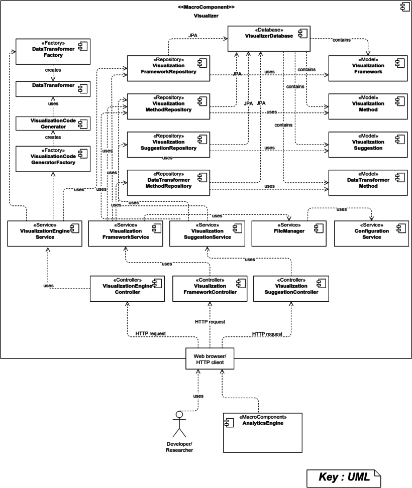

# VISUALIZER: COMPONENT AND CONNECTOR VIEWS

## Primary Presentation

## Element Catalog
### Components
* **&#60;&#60;database&#62;&#62; VisualizerDataBase**: This is a database which holds the data containing the uploaded Visualization Frameworks,Methods and Suggestions along with the Data Transformers.The CRUD operations are performed on the database via the appropriate repositories
* **&#60;&#60;repository&#62;&#62; VisualizationFrameworkRepository**: Provides an interface for database operations (creation, updating, retrieval or deletion of records) to be performed on the `VisualizationFramework`
* **&#60;&#60;repository&#62;&#62; VisualizationMethodRepository**: Provides an interface for interacting with the `VisualizationMethod`
* **&#60;&#60;repository&#62;&#62; VisualizationSuggestionRepository**: Provides an interface for database operations to be performed on the `VisualizationSuggestion`
* **&#60;&#60;repository&#62;&#62; DataTransformerRepository**: Provides an interface for interacting with the `DataTransformer`
* **&#60;&#60;model&#62;&#62;VisualizationFramework**: The object holds the information about a VisualizationFramework that was uploaded by Developers/Researchers to the Visualizer macrocomponent
* **&#60;&#60;model&#62;&#62;VisualizationMethod**: Instance of this component holds the information about a VisualizationMethod. A VisualizationMethod belongs to a VisualizationFramework and is part of the bundled JAR that was uploaded by Developers/Researchers to the Visualizer macrocomponent
* **&#60;&#60;model&#62;&#62;VisualizationSuggestion**: An instance of this component holds the information about a VisualizationFramework that was uploaded by Developers/Researchers to the Visualizer macrocomponent
* **&#60;&#60;model&#62;&#62;DataTransformerMethod**: The object holds information about a DataTransformer that was uploaded by Developers/Researchers to the Visualizer macrocomponent
* **&#60;&#60;factory&#62;&#62;DataTransformerFactory**: An abstract factory providing functions to create of DataTransformer objects at runtime. These objects contain the concrete behavior to transform data from the OLAPDataSet into a format parseable by the relative VisualizationMethod
* **&#60;&#60;factory&#62;&#62;VisualizationCodeGeneratorFactory**: An abstract factory providing functions to create VisualizationCodeGenerators (VisualizationMethod) objects at runtime. Instances of the VisualizationCodeGenerator contain client visualization code
* **&#60;&#60;factory&#62;&#62;DataTransformerFactory**: An abstract factory providing functions to create of DataTransformer objects at runtime
* **DataTransformer**: A concrete instance created by the `DataTransformerFactory`
* **VisualizationCodeGenerator**: A concrete instance created by the `VisualizationCodeGeneratorFactory`
* **&#60;&#60;service&#62;&#62;VisualizationEngineService**: A service which provides methods for the `VisualizationEngineController` to call to generate the visualization code
* **&#60;&#60;service&#62;&#62;VisualizationFrameworkService**: This is a core administration service of the `Visualizer` macrocomponent. It provides methods for the `VisualizationFrameworkController` to expose the available Visualization Frameworks and their Methods. In addition, also methods for the controller to create, update or delete existing ones
* **&#60;&#60;service&#62;&#62;VisualizationSuggestionService**: A service which exposes methods for the `VisualizationSuggestionController` to create new VisualizationSuggestion along with retrieving, updating and removing existing ones
* **&#60;&#60;service&#62;&#62;ConfigurationService**: A service which provides access to the configuration parameters of the application
* **&#60;&#60;service&#62;&#62;FileManager**: A service which exposes methods to access the file storage system of the `Visualizer` macrocomponent
* **&#60;&#60;controller&#62;&#62;VisualizationEngineController**: This controller exposes a RESTful API with methods for generating the visualization code
* **&#60;&#60;controller&#62;&#62;VisualizationFrameworkController**: This controller exposes a RESTful API with methods for uploading, modifying, removing and browsing `VisualizationFramework` and `VisualizationMethod`. It also contains an endpoint to check the input ports of a `VisualizationMethod`.
* **&#60;&#60;controller&#62;&#62;VisualizationSuggestionController**: This controller exposes a RESTful API with methods for uploading, modifying, removing and browsing `VisualizationSuggestion`
* **&#60;&#60;user&#62;&#62;Developer/Researcher**: The user interacts with the Visualizer macrocomponent via sending HTTP requests to the RESTful API exposed by the controllers
* **&#60;&#60;macrocomponent&#62;&#62;AnalyticsEngine**: Being the core macrocomponent of the OpenLAP platform the `AnalyticsEngine` has full access to the `Visualizer` API. It is through the `AnalyticsEngine` that user/client requests will reach the `Visualizer`

### Connectors
* **HTTP request**: Endpoints of the controllers are accessed via HTTP requests sent by clients
* **JPA**: Java Persistence API specification used to access the database
* **VisualizerDatabase&#60;&#60;contains&#62;&#62;VisualizationFramework**: Represents records of `VisualizationFramework` stored in the `VisualizerDatabase`
* **VisualizerDatabase&#60;&#60;contains&#62;&#62;VisualizationMethod**: Represents records of `VisualizationMethod` stored in the `VisualizerDatabase`
* **VisualizerDatabase&#60;&#60;contains&#62;&#62;VisualizationSuggestion**: Represents records of `VisualizationSuggestion` stored in the `VisualizerDatabase`
* **VisualizerDatabase&#60;&#60;contains&#62;&#62;DataTransformerMethod**: Represents records of `DataTransformerMethod` stored in the `VisualizerDatabase`

* **VisualizationFrameworkRepository&#60;&#60;uses&#62;&#62;VisualizationFramework**: The repository `VisualizationFrameworkRepository` uses the model `VisualizationFramework` to map the objects to database records and vice versa
* **VisualizationMethodRepository&#60;&#60;uses&#62;&#62;VisualizationMethod**: The repository `VisualizationMethodRepository` uses the model `VisualizationMethod` to map the objects to database records and vice versa
* **VisualizationSuggestionRepository&#60;&#60;uses&#62;&#62;VisualizationSuggestion**: The repository `VisualizationSuggestionRepository` uses the model `VisualizationSuggestion` to map the objects to database records and vice versa
* **DataTransformerMethodRepository&#60;&#60;uses&#62;&#62;DataTransformerMethod**: The repository `DataTransformerMethodRepository` uses the model `DataTransformerMethod` to map the objects to database records and vice versa
* **VisualizationEngineService&#60;&#60;uses&#62;&#62;DataTransformerFactory**: `VisualizationEngineService` uses the factory methods provided by `DataTransformerFactory` to create instances of the required `DataTransformer` in order to transform data from the OLAPDataSet into a form parseable by the `VisualizationMethod`
* **VisualizationEngineService&#60;&#60;uses&#62;&#62;VisualizationCodeGeneratorFactory**: `VisualizationEngineService` uses the factory methods provided by `VisualizationCodeGeneratorFactory` to create instances of the required `VisualizationCodeGenerator` in order to generate the client visualization code
* **VisualizationEngineService&#60;&#60;uses&#62;&#62;VisualizationFrameworkRepository**: `VisualizationEngineService` uses the repository `VisualizationFrameworkRepository` to get access to the `VisualizationFramework` information existing in the database. From this information the service can create the relevant instances required to generate the visualization code
* **VisualizationFrameworkService&#60;&#60;uses&#62;&#62;VisualizationFrameworkRepository**: `VisualizationFrameworkService` uses the repository `VisualizationFrameworkRepository` to perform CRUD operations on the `VisualizationFramework` records
* **VisualizationFrameworkService&#60;&#60;uses&#62;&#62;VisualizationMethodRepository**: `VisualizationFrameworkService` uses the repository `VisualizationMethodRepository` to perform CRUD operations on the `VisualizationMethod` records
* **VisualizationFrameworkService&#60;&#60;uses&#62;&#62;DataTransformerMethodRepository**: `VisualizationFrameworkService` uses the repository `VisualizationMethodRepository` to perform CRUD operations on the `DataTransformerMethod` records
* **VisualizationFrameworkService&#60;&#60;uses&#62;&#62;FileManager**: `VisualizationFrameworkService` uses the the `FileManager` service to perform file based operations on the Visualizer macrocomponent's storage system
* **VisualizationSuggestionService&#60;&#60;uses&#62;&#62;VisualizationSuggestionRepository**: `VisualizationSuggestionService` uses the repository `VisualizationSuggestionRepository` to perform CRUD operations on the `VisualizationSuggestion` records in the database
* **VisualizationSuggestionService&#60;&#60;uses&#62;&#62;VisualizationMethodRepository**: `VisualizationFrameworkService` uses the repository `VisualizationMethodRepository` to retrieve information about `VisualizationMethod` records in order to make the connection between a `VisualizationMethod` and a `VisualizationSuggestion`
* **FileManager&#60;&#60;uses&#62;&#62;ConfigurationService**: `FileManager` uses the  `ConfigurationService` to access to the application's configuration parameters. These configuration parameters include the temporary and permanent locations where the `FileManager` should store files along with the extension of the uploaded files   
* **VisualizationEngineController&#60;&#60;uses&#62;&#62;VisualizationEngineService**: `VisualizationEngineController` uses the  `VisualizationEngineService` to service the incoming client requests. Client request reaching the `VisualizationEngineController` include that for generation of visualization code using a certain `VisualizationFramework` and `VisualizationMethod`
* **VisualizationFrameworkController&#60;&#60;uses&#62;&#62;VisualizationFrameworkService**: `VisualizationFrameworkController` uses the  `VisualizationFrameworkService` to service the incoming client requests. These clients requests range from performing CRUD operations on the `VisualizationFramework`, `VisualizationMethod` and `DataTransformer` to validating a `VisualizationMethod`'s input ports
* **VisualizationSuggestionController&#60;&#60;uses&#62;&#62;VisualizationSuggestionService**: `VisualizationSuggestionController` uses the  `VisualizationSuggestionService` to service the incoming client requests. These clients requests include performing CRUD operations on the `VisualizationSuggestion` records in the database

## Context Diagram

## Variability Guide
* &#60;&#60;Factory&#62;&#62;DataTransformerFactory = The &#60;&#60;Factory&#62;&#62;DataTransformerFactory is an interface which has to be implemented to provide a concrete implementation of the factory. The methods which are implemented contain the code to create instances of the `DataTransformer` from the class name. The default implementation of the factory uses the JCL library to load the `DataTransformer` classes

* &#60;&#60;Factory&#62;&#62;VisualizationCodeGeneratorFactory = The &#60;&#60;Factory&#62;&#62;VisualizationCodeGeneratorFactory is an interface which has to be implemented to provide a concrete implementation of the factory. The methods which are implemented contain the code to create instances of the `VisualizationCodeGenerator` from the class name. The default implementation of the factory uses the JCL library to load the `VisualizationCodeGenerator` classes

* VisualizationCodeGenerator = The `VisualizationCodeGenerator` is an abstract class which has methods that must be overriden by the concrete implementations. These abstract methods specify the generation of the visualization code which is sent back to client requests as well as the input and output ports in the form of the OLAPDataSet. The output ports can be safely ignored, however the input port configuration is crucial as it is used to determine if the incoming OLAPDataSet can be processed by the `VisualizationCodeGenerator`

* DataTransformer = The `DataTransformer` is an interface which has to be implemented to provide for a concrete implementation of the algorithm to transform data from the OLAPDataSet into a form parseable by the `VisualizationCodeGenerator`

## Rationale

* The OLAPDataset (Column configuration) has to be included via an overriden method in each `VisualizationCodeGenerator`. Although, this would belong in the `DataTransformer` it was explicitly included in the `VisualizationCodeGenerator` due to the reason that a single `DataTransformer` can be reused by many `VisualizationCodeGenerators`

## Related Views
* Section 4.4.1 explains the static Module Views of the Visualizer
* Section 4.2 explains the Analytics Engine, which orchestrates the interaction with the Visualizer
* Section 4.5 explains the Analytics Methods, which process the data that is to be visualized
* Section 4.6 explains the Analytics Modules, which holds Triads that allow to save configurations between Indicators, Analytics Methods and Visualizations
